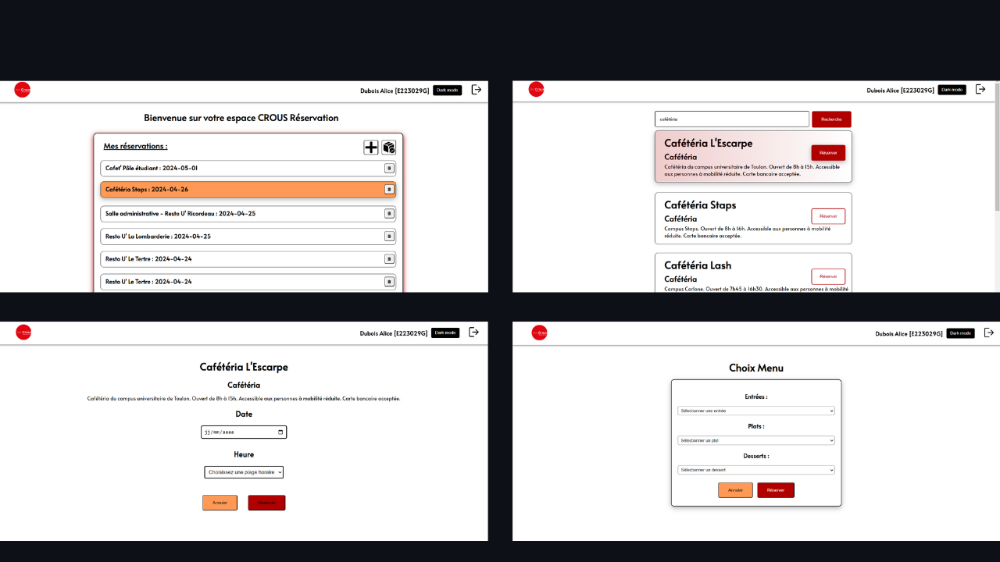

# Crous_Reservation

Projet d'application pour la réservation de repas pour les étudiants du Crous.

## Instructions d'installation

Pour faire fonctionner l'application, veuillez suivre les étapes suivantes :

1. **Importer la base de données** :
   - Assurez-vous d'avoir un serveur MySQL (par exemple, WAMP, XAMPP) installé sur votre machine.
   - Utilisez phpMyAdmin ou un autre outil de gestion de base de données pour importer la base de données fournie avec l'application.
   - Les informations de connexion à la base de données sont les suivantes :
     - Host : localhost
     - Port : 8889 (si vous utilisez MAMP)
     - Nom de la base de données : php
     - Nom d'utilisateur : php
     - Mot de passe : php
     - Charset : utf8

2. **Exécutez les fichiers de création et d'insertion** :
   - Dans le dossier "creation_db", vous trouverez des fichiers SQL pour créer les tables nécessaires à l'application et insérer des données.
   - Exécutez ces fichiers SQL dans votre outil de gestion de base de données pour créer les tables et insérer les données.

3. **Accédez à l'application** :
   - Une fois que vous avez importé la base de données et exécuté les fichiers de création et d'insertion, vous pouvez accéder à l'application dans un navigateur web.

## Utilisateur de test
- Pour vous connecter à l'application en tant qu'utilisateur test, utilisez les informations suivantes :
  - Login : E223029G
  - Mot de passe : 123

